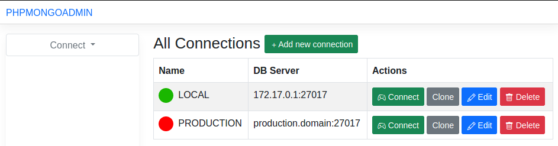

# phpmongoadmin

## Using Docker

Requirements

- docker

### Linux

```bash
mkdir phpmongoadmin
cd phpmongoadmin
touch database.sqlite
docker run -d \
        --name phpmongoadmin \
        --restart=always \
        -p 8080:80 \
        -v $(pwd)/database.sqlite:/home/app/database/database.sqlite \
        dangdungcntt/phpmongoadmin
```

### Windows

Create folder `phpmongoadmin` and file `database.sqlite` inside.

Run this command in `phpmongoadmin` folder

```
docker run -d \
        --name phpmongoadmin \
        --restart=always \
        -p 8080:80 \
        -v %cd%/database.sqlite:/home/app/database/database.sqlite \
        dangdungcntt/phpmongoadmin
```

Visit [http://localhost:8080](http://localhost:8080)

## Using as Laravel application

Requirements

- php `^8.0`
- extension `mongodb`
- all requirements for `Laravel 8`

Run this project as normal Laravel application.

Read [Laravel docs](https://laravel.com/docs/8.x)

## Screenshots



